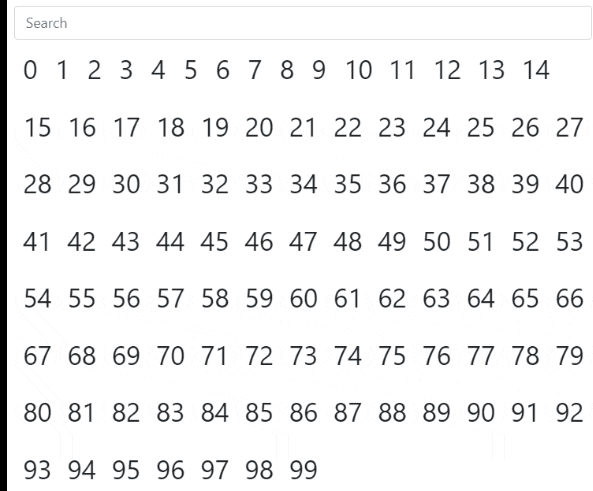

# co-virtualize

&nbsp;
&nbsp;
&nbsp;

A React library to enable the extension and decoupling of a component's lifetime.

`npm i co-virtualize`

## **Why?**
Sometimes you want to show a fade-out animation after a component has been removed from a list.

*[List Example](https://cocoss-org.github.io/co-virtualize/list)*

Virtualization of components allows to let the virtualized component live after it's originator has been killed. A new owner can also regain control of the virtual component to enable all sorts of fancy animations.

## **How?**
We use the `useVirtual` hook to create a virtual component. The hook taks a component, which should be virtualized and properties for this component and will create a instance of this component as a virtual component. A `VirtualBase` serves as the origin for all virtual components and offers the required functionality for virtualization.  
A virtualized component has, aside from the passed properties, a `connected` flag and `destroy` function as properties.  
The `connected` flag is `true` when the originator is alive and turns flase when he dies. The `destroy` function enables the component to end it's own existance.

## [Examples](https://cocoss-org.github.io/co-virtualize/)

* [List](https://cocoss-org.github.io/co-virtualize/list) - Tutorial for a filtered list that animates the creation and destruction of it's ListItems